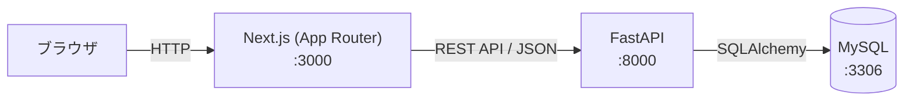
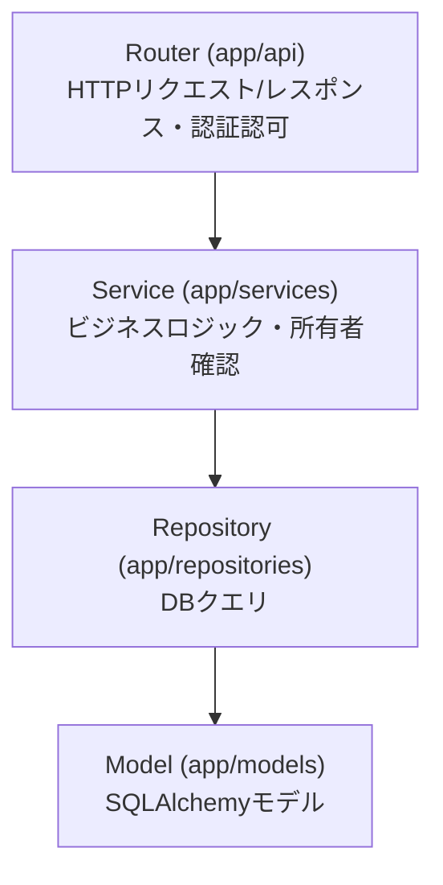

# StudyLog

ITを学習しているユーザーが、学習内容・学習時間・理解度を記録し、学習状況を継続的に確認できる学習記録管理Webアプリケーション。Next.js / FastAPI / MySQLの技術学習を目的とした個人開発プロジェクトです。

## 目次

- [主な機能](#主な機能)
- [権限](#権限)
- [技術スタック](#技術スタック)
- [技術選定理由](#技術選定理由)
- [アーキテクチャ](#アーキテクチャ)
- [ディレクトリ構成](#ディレクトリ構成)
- [セキュリティ](#セキュリティ)
- [テスト](#テスト)
- [CI/CD](#cicd)
- [セットアップ](#セットアップ)
- [ドキュメント](#ドキュメント)

## 主な機能

- **ユーザー登録・ログイン**：JWT（HttpOnly Cookie）による認証
- **学習記録の管理**：登録・一覧・編集・削除（論理削除）
  - キーワード検索、カテゴリ・理解度・学習期間による絞り込み
  - 10件単位のページネーション
  - 星クリック式の理解度入力（1〜5）
- **ダッシュボード**：今日の学習時間、連続学習日数、日別/カテゴリ別/月別の学習時間グラフ、直近5件の学習記録
- **カテゴリ管理**（ADMIN）：追加・変更・論理削除
- **ユーザー管理**（ADMIN）：全ユーザー一覧、他ユーザーの学習記録閲覧（閲覧専用）

## 権限

| 機能 | USER | ADMIN |
| --- | :---: | :---: |
| 自分の学習記録の登録・閲覧・編集・削除 | ○ | ○ |
| ダッシュボードの利用 | ○ | ○ |
| カテゴリの追加・変更・論理削除 | - | ○ |
| 全ユーザーの一覧確認 | - | ○ |
| 他ユーザーの学習記録閲覧（閲覧専用、編集・削除不可） | - | ○ |

## 技術スタック

すべて実際の設定ファイル（`requirements.txt` / `package.json` / `Dockerfile` / `docker-compose.yml` / CI設定）に基づく実バージョンです。

### Backend

| 技術 | バージョン |
| --- | --- |
| Python（実行環境） | 3.12（`backend/Dockerfile`） |
| Python（CI・型/Lint対象） | 3.11（`.github/workflows/ci.yml`、`pyproject.toml`の`target-version`） |
| FastAPI | 0.115.6 |
| SQLAlchemy | 2.0.36 |
| Alembic | 1.14.0 |
| Pydantic / pydantic-settings | 2.10.4 / 2.7.1 |
| python-jose（JWT） | 3.3.0 |
| passlib + bcrypt（パスワードハッシュ） | 1.7.4 / 4.0.1 |
| pytest | 8.3.4 |
| Ruff（Lint / Format） | 0.8.4 |

> **既知の差異**：実行環境（Docker）はPython 3.12、CIのテスト実行およびRuffの`target-version`は3.11に設定されており、バージョンが揃っていません。将来的にどちらかへ統一する予定です。

### Frontend

| 技術 | バージョン |
| --- | --- |
| Node.js | 22（`frontend/Dockerfile`） |
| Next.js（App Router） | 16.3.4 |
| React | 19.2.8 |
| TypeScript | ^5 |
| ESLint | ^9 |
| Vitest | ^4.1.11 |
| React Testing Library | ^16.3.3 |
| recharts（グラフ描画） | ^3.10.1 |

### インフラ

| 技術 | バージョン |
| --- | --- |
| MySQL | 8.0（`docker-compose.yml`） |
| Docker Compose | frontend / backend / db の3サービス構成 |
| CI | GitHub Actions（PR時に自動実行） |

## 技術選定理由

以前開発したタスク管理アプリ（Java / Spring Boot、React、PostgreSQL）から意図的に構成を変え、異なる技術スタックでのWebアプリケーション開発を経験することを目的として選定しました。

### Frontend

- **Next.js**：前回はReactのみでフロントエンドとバックエンドが分離していなかったため、Next.jsを採用しFastAPIとREST APIで連携する構成を新たに経験する。App Routerのroute groupで認証必須ページ（`(protected)`）を一括管理でき、USER/ADMINの権限分岐を持つ本アプリの画面構成と相性が良い
- **TypeScript**：バックエンド（Pydantic）が型付きスキーマでリクエスト/レスポンスを検証しているため、フロントエンド側も型定義を通すことでAPI連携時の実行時エラーを減らす

### Backend

- **Python / FastAPI**：前回はJava / Spring Bootを使用したため、異なるプログラミング言語でのWeb API開発を経験する目的で採用。PythonはWeb開発だけでなくAI・データ分析など幅広い分野で使われており、今後の学習の幅を広げられると考えた。型ヒントベースのバリデーションが、学習記録の各種入力制約（理解度の範囲、学習時間の上限など）と自然に噛み合う
- **SQLAlchemy / Alembic**：FastAPIと組み合わせて採用実績の多いORMを用い、スキーマ変更をマイグレーションとして履歴管理する経験を積む

### Database

- **MySQL**：前回はPostgreSQLを使用したため、異なるRDBMSを扱う経験を得る目的で採用。基本的なSQLの知識を活かしながら、MySQL特有のデータ型やSQLの仕様、データベース設計を学ぶ

### インフラ・開発基盤

- **Docker / Docker Compose**：フロントエンド・バックエンド・DBという3つの独立したサービスを、開発者のローカル環境差異に依存せず同じ手順で再現できるようにするため
- **GitHub Actions**：Issue → Branch → PRというGitフローの実践に合わせ、PRごとに自動テスト・Lintを実行するCI/CDパイプラインを構築する経験を積む

### 可視化

- **Recharts**：Reactコンポーネントとして宣言的にグラフを書けるライブラリで、Next.js / Reactとの親和性が高く、ダッシュボードのグラフ描画に採用した

## アーキテクチャ



### Backend：レイヤードアーキテクチャ



Router → Service → Repository → Model の4層構成で責務を分離しています。

### Frontend：認証・認可の一元化

Next.jsのroute group（`(protected)`）で保護ページをまとめ、`(protected)/layout.tsx`でログイン確認、`(protected)/admin/layout.tsx`でADMIN権限確認を行う2階層構成です。認証済みユーザー情報は`AuthContext`で配下のページに供給されます。

### 認証・認可の流れ

- JWTは**HttpOnly Cookie**に保存（有効期限1時間）
- CSRF対策として**Double Submit Cookie方式**を採用（`csrf_token`Cookie + `X-CSRF-Token`ヘッダー）
- 状態変更を伴うAPI（POST/PUT/DELETE）はCSRF検証必須

## ディレクトリ構成

```
StudyLog/
├── backend/
│   ├── app/
│   │   ├── api/          # Router（エンドポイント定義）
│   │   ├── services/      # ビジネスロジック
│   │   ├── repositories/  # DBアクセス
│   │   ├── models/        # SQLAlchemyモデル
│   │   ├── schemas/       # Pydanticスキーマ（リクエスト/レスポンス）
│   │   ├── core/          # 設定・認証・JST日付処理
│   │   ├── exceptions/    # エラー定義・共通ハンドラ
│   │   └── db/            # DB接続・seedスクリプト
│   ├── alembic/           # マイグレーション
│   └── tests/             # pytest（97件）
├── frontend/
│   ├── app/
│   │   ├── (protected)/   # 認証必須ページ（layout.tsxで一括認可）
│   │   ├── login/, register/
│   ├── components/        # layout / study-record / dashboard / common
│   ├── lib/                # API通信・認証状態管理
│   └── types/               # 型定義
├── docs/incidents/        # 開発中に発生した問題の調査記録
└── .github/workflows/     # CI設定
```

## セキュリティ

- パスワードは**bcrypt**でハッシュ化して保存
- JWTはHttpOnly Cookieに保存し、フロントエンドのJavaScriptから直接アクセス不可
- CSRF対策としてDouble Submit Cookie方式を採用
- CORSは開発環境で`http://localhost:3000`のみ許可（ワイルドカード不使用）
- 学習記録の取得・変更時は、ログインユーザーIDと対象レコードのuser_idを突き合わせて所有者を確認
- 論理削除方式（`is_deleted`）を採用し、物理削除は行わない

## テスト

| 対象 | 件数 | フレームワーク |
| --- | --- | --- |
| Backend | 97件 | pytest |
| Frontend | 39件（16ファイル。共通UIコンポーネント、学習記録フォームコンポーネント、主要画面の表示確認） | Vitest + React Testing Library |

テストの詳細（何をどのような観点でテストしているか）は [docs/テスト仕様書.md](docs/テスト仕様書.md) を参照。

```bash
# Backend
cd backend
pytest tests/ -v
ruff check .
ruff format --check .

# Frontend
cd frontend
npm run lint
npx tsc --noEmit
npm run test
npm run build
```

## CI/CD

GitHub Actionsで、`main`ブランチへのPull Request作成・更新時に以下を自動実行します。

- `backend`ジョブ：MySQLをサービスコンテナとして起動し、Ruff（lint/format）とpytestを実行
- `frontend`ジョブ：ESLint、TypeScript型チェック、Vitest、本番ビルドを実行

`main`ブランチにはBranch Protection Ruleを設定しており、上記2ジョブが成功しない限りマージできません（管理者にも適用）。

## セットアップ

```bash
cp .env.example .env
docker compose up -d --build
```

初回起動時はDBにテーブルが作成されていないため、マイグレーションと初期データ投入を行います。

```bash
docker compose run --rm backend alembic upgrade head
docker compose run --rm backend python -m app.db.seed
```

- フロントエンド: http://localhost:3000
- バックエンドAPI: http://localhost:8000 （`/health` でヘルスチェック、`/docs` でSwagger UI）
- MySQL: localhost:3306

seedスクリプトにより、初期カテゴリ（Java, Spring Boot, JavaScript, TypeScript, React, Next.js, Python, SQL, AWS, Git, Docker, その他）と管理者アカウント（`.env`の`SEED_ADMIN_USERNAME` / `SEED_ADMIN_PASSWORD`、デフォルトは`admin` / `ChangeMe123`）が作成されます。

## ドキュメント

- [docs/incidents/](docs/incidents/)：開発中に発生したエラー・不具合の調査記録
- [CLAUDE.md](CLAUDE.md)：開発運用ルール（Git運用、エラー調査の記録方針）
