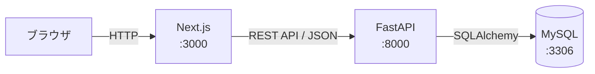

# StudyLog 開発仕様書

> このドキュメントはPhase 1〜10の実装・レビューを経て、実際のBackend/Frontend実装と整合するよう更新された正式な仕様書です。当初の仕様からの変更点には「（Phase 9で確認・追記）」等の注記を付けています。プロジェクトの目的や背景は [docs/要件定義.md](../要件定義.md) を、セットアップ手順や技術スタックは [README.md](../../README.md) を参照してください。

## 1. プロジェクト概要

### 1.1 アプリケーション名

**StudyLog**

### 1.2 目的

ITを学習しているユーザーが、自分の学習内容・学習時間・理解度を記録し、学習状況を継続的に確認できるWebアプリケーションを開発する。

未経験者から経験者まで幅広く利用できることを想定する。

### 1.3 開発目的

本アプリケーションの開発を通して、以下の技術・知識を実践的に習得する。

- Next.js
- TypeScript
- Python
- FastAPI
- REST API
- MySQL
- SQLAlchemy
- JWT認証
- HttpOnly Cookie
- 認証・認可
- Docker
- Git / GitHub
- API設計
- テスト
- Lint / Formatter

---

## 2. 技術構成

正確なバージョンは [README.md](../../README.md#技術スタック) を参照。

| 項目 | 採用技術 |
| --- | --- |
| フロントエンド | Next.js（App Router） |
| 言語 | TypeScript |
| バックエンド | Python |
| APIフレームワーク | FastAPI |
| ORM | SQLAlchemy |
| データベース | MySQL |
| 認証 | JWT |
| JWT保存 | HttpOnly Cookie |
| コンテナ | Docker / Docker Compose |
| テスト（Backend） | Pytest |
| テスト（Frontend） | Vitest + React Testing Library（Phase 8で追加） |
| Frontend Lint | ESLint |
| Backend Lint / Format | Ruff |
| CI | GitHub Actions（Phase 9で追加） |
| API形式 | REST API |
| データ形式 | JSON |
| グラフ描画 | Recharts（Phase 10で追加。ダッシュボードの日別/カテゴリ別/月別学習時間グラフに使用） |

---

## 3. システム構成



開発環境では以下の構成とする。

```text
Docker Compose
│
├── frontend
│   └── Next.js :3000 (npm run dev)
│
├── backend
│   └── FastAPI :8000 (uvicorn --reload)
│
└── db
    └── MySQL :3306（ホストにも公開）
```

### 3.1 本番環境（AWSデプロイ検証）との違い

学習目的の実機デプロイ検証として、AWS EC2 1台上に本番相当の構成を構築できるようにしている。詳細な構成図・アクセス経路は[README.mdの本番デプロイ構成（AWS）](../../README.md#本番デプロイ構成aws)を参照。開発環境との主な違いは以下の通り。

| 項目 | 開発環境 | 本番環境（AWS） |
| --- | --- | --- |
| frontendの起動方式 | `npm run dev`（開発サーバー） | `npm run build` → `npm run start`（本番ビルド） |
| backendの起動方式 | `uvicorn --reload` | `uvicorn`（reloadなし）。起動時に`alembic upgrade head`とadminシード投入を実行 |
| MySQLの3306番ポート | ホストに公開（ローカルからDB直接接続可能） | 非公開（コンテナ間ネットワークのみ） |
| Dockerイメージのbuild場所 | ローカル環境（Docker Compose） | ローカル(Mac)。EC2上ではbuildを行わない |
| インフラ構築方法 | Docker Composeを手元で起動 | Terraformで EC2 / Security Group / SSHキーペアを構築 |

### 3.2 設計判断：EC2上でのbuildを採用しなかった理由

当初はEC2上で`docker compose up --build`を実行し、git clone直後にビルド・起動まで完結させる方式を想定していた。しかし実機検証の結果、EC2インスタンス（t3.micro、メモリ1GB）上でNext.jsの本番ビルドを実行するとメモリ不足でOSごと応答不能になることが判明した（調査の詳細は[docs/incidents/2026-09-03-ec2-build-oom.md](../incidents/2026-09-03-ec2-build-oom.md)）。

このため、Dockerイメージのbuildはローカル(Mac)で行い、`docker save` → `scp` → `docker load`でEC2にイメージを転送してコンテナを起動する方式に変更した。EC2側で発生する処理はコンテナの実行のみとなり、この方式で実機起動を確認できている。

この判断に伴い、Terraformが担うのは「EC2がDockerを実行できる状態を作るところまで」とし、アプリケーションのビルド・転送・起動は`deploy/deploy.sh`（デプロイスクリプト）の責務として分離した。

---

## 4. ユーザー仕様

### 4.1 ユーザー登録

ユーザー登録は必須。

登録時に以下を設定する。

- ユーザー名
- パスワード

#### ユーザー名

- 必須
- 1〜25文字
- ユニーク
- **文字種：半角英数字・ハイフン（`-`）・アンダースコア（`_`）のみ**（`^[A-Za-z0-9_-]{1,25}$`、Phase 9で実装から確認・追記。当初の仕様には文字種の制限記載がなかった）

#### パスワード

- 必須
- 最大50文字
- 小文字を1文字以上含む
- 大文字を1文字以上含む
- 数字を1文字以上含む

#### パスワード確認

登録画面ではパスワード確認欄を設ける。

入力したパスワードと一致している必要がある。

---

## 5. 権限

ユーザーには以下の2種類のRoleを設定する。

```text
USER
ADMIN
```

権限の詳細は [README.md](../../README.md#権限) の表を参照。

### 管理者による他ユーザー記録の操作

他ユーザーの学習記録は**閲覧のみ**とする。

編集・削除はできない。

---

## 6. 認証仕様

### 6.1 認証方式

JWTを使用する。

Next.jsとFastAPIをREST APIで分離する構成のため、クライアントとサーバー間の認証情報をトークンとして扱えるJWTを採用する。

また、認証・認可の仕組みを学習することも目的とする。

### 6.2 JWT保存場所

JWTは**HttpOnly Cookie**に保存する。

Next.jsのJavaScriptからJWT本体を直接取得・保存しない。

### 6.3 JWT有効期限

**1時間**（`jwt_expire_minutes = 60`）。Cookie自体の`max_age`もJWTの有効期限と同じ秒数（`jwt_expire_minutes * 60`）に設定し、ブラウザ側でも同じタイミングで自動失効する。

### 6.4 JWT Payload

最低限以下を含める。

```json
{
  "sub": "123",
  "role": "USER",
  "exp": 1788300000
}
```

- `sub`：ユーザーID
- `role`：ユーザー権限
- `exp`：有効期限

パスワードなどの機密情報はJWTに含めない。

### 6.5 CSRF対策（Phase 9で実装内容を追記）

状態変更を伴うAPI（POST/PUT/DELETE）に対して、**Double Submit Cookie方式**でCSRF対策を行う。

- ログイン成功時に`csrf_token`（非HttpOnly Cookie、`samesite=lax`）を発行する
- クライアントはこのCookieの値を`X-CSRF-Token`ヘッダーに載せてリクエストする
- サーバーはCookieの値とヘッダーの値が一致することを検証する（`verify_csrf_token`）
- 認証チェックはCSRF検証より先に評価される（未認証+CSRF不正 → 401、認証済み+CSRF不正 → 403）

### 6.6 ログアウト

ログアウト時はJWT・CSRFトークンを保存しているCookieを削除する。

---

## 7. 学習記録仕様

### 7.1 学習記録項目

| 項目 | 必須 | 内容 |
| --- | --- | --- |
| カテゴリ | ○ | 学習分野 |
| タイトル | ○ | 学習内容のタイトル |
| 学習内容 | ○ | 詳細な学習内容 |
| 理解度 | ○ | 1〜5 |
| 学習時間 | ○ | 分単位 |
| 学習日 | ○ | 学習した日 |

### 7.2 タイトル

- 必須
- 1〜100文字

### 7.3 学習内容

- 必須
- 1文字以上

### 7.4 理解度

1〜5の5段階。

UIではラジオボタンを使用せず、**星を直接クリックして選択するUI**とする。

初期値は、**★★★☆☆（3）** とする。

一覧などで表示する場合も星形式を使用する。

### 7.5 学習時間

分単位で記録する。

最低1分。**上限1440分（24時間）**（Phase 9で実装から確認・追記。当初の仕様には上限の記載がなかった）。

0分、負数、小数は不可。

### 7.6 学習日

未来の日付は登録不可。

```text
今日以前 → OK
明日以降 → NG
```

「今日」の判定は**JST（Asia/Tokyo）基準**で行う（`app/core/clock.py`の`today_jst()`。backendコンテナ・CIランナーはUTCで動作しているため、`date.today()`ではJST 15:00〜23:59に誤判定が起きることが判明し、Phase 9で修正済み）。

### 7.7 1日複数件

同一ユーザーが同じ日に複数の学習記録を登録できる。

---

## 8. 学習記録削除

学習記録は物理削除ではなく**論理削除**とする。

```text
is_deleted = TRUE
```

通常の一覧・検索・集計では、

```text
is_deleted = FALSE
```

のデータのみ対象とする。

---

## 9. カテゴリ仕様

### 9.1 初期カテゴリ

アプリケーションには以下の初期カテゴリを用意する（`app/db/seed.py`）。

- Java
- Spring Boot
- JavaScript
- TypeScript
- React
- Next.js
- Python
- SQL
- AWS
- Git
- Docker
- その他

### 9.2 カテゴリ管理

ADMINのみ操作可能。

- 追加
- 変更
- 論理削除

### 9.3 カテゴリ名

- 必須
- 1〜50文字
- 重複不可（論理削除されていないカテゴリの中でのみ一意、9.4節参照）

### 9.4 カテゴリ削除

カテゴリは論理削除する。

既存の学習記録は削除しない。

削除済みカテゴリは、

- 新規学習記録登録時の選択肢には表示しない
- 学習記録に紐づいている過去データでは表示する

#### UNIQUE制約の実装方式（Phase 9で実装から確認・追記）

「論理削除後は同名で再登録できる」という9.4節の要件を満たすため、単純なUNIQUE制約ではなく、**生成カラム（Computed Column）による部分ユニーク制約**を採用している。

```sql
active_name = IF(is_deleted = 0, name, NULL)
```

`is_deleted = FALSE`の行のみ`active_name`に`name`の値が入り、`is_deleted = TRUE`の行は`NULL`になる。MySQLのUNIQUEインデックスは複数のNULLを許容するため、`active_name`にUNIQUE制約を張ることで「未削除カテゴリの中でのみ名前が一意」という制約を実現している。

---

## 10. 画面一覧

| No | 画面 | URL | 権限 |
| --- | --- | --- | --- |
| 1 | ユーザー登録 | `/register` | 全員 |
| 2 | ログイン | `/login` | 全員 |
| 3 | ダッシュボード | `/dashboard` | USER / ADMIN |
| 4 | 学習記録一覧 | `/study-records` | USER / ADMIN |
| 5 | 学習記録登録 | `/study-records/new` | USER / ADMIN |
| 6 | 学習記録編集 | `/study-records/[id]/edit` | 所有者 |
| 7 | カテゴリ管理 | `/admin/categories` | ADMIN |
| 8 | ユーザー管理 | `/admin/users` | ADMIN |
| 9 | 他ユーザー学習記録 | `/admin/users/[id]/study-records` | ADMIN |

---

## 11. 共通レイアウト

Phase 10でModern Dark Design Systemを導入し、ヘッダー・サイドバーの配色をDesign Tokenに置き換えた（項目構成・ハンバーガーメニューの挙動自体は変更していない）。Design Tokenおよび共通UIコンポーネントの詳細は [47. Design System / 共通UIコンポーネント](#47-design-system--共通uiコンポーネント) を参照。

### ヘッダー

```text
StudyLog                         ユーザー名 ▼
```

ユーザー名をクリックするとログアウト操作を表示する。

### サイドバー

USER：

```text
ダッシュボード
学習記録
学習記録登録

────────────

ログアウト
```

ADMIN：

```text
ダッシュボード
学習記録
学習記録登録

────────────

カテゴリ管理
ユーザー管理

────────────

ログアウト
```

### レスポンシブ

PCではサイドバーを表示。

スマートフォンではハンバーガーメニューからサイドバーを開閉できるようにする。

---

## 12. ユーザー登録画面

URL：`/register`

### 入力

- ユーザー名
- パスワード
- パスワード確認

### ボタン

- 登録する
- ログインはこちら

### 成功

登録完了後、ログイン画面へ遷移。

### エラー

ユーザー名重複：

```text
このユーザー名は既に使用されています。
```

---

## 13. ログイン画面

URL：`/login`

### 入力

- ユーザー名
- パスワード

### 成功

```text
/login
 ↓
/dashboard
```

### ログイン失敗

```text
ユーザー名またはパスワードが正しくありません。
```

ユーザー名の存在・不存在を個別に表示しない。

---

## 14. ダッシュボード

URL：`/dashboard`

以下を表示する。

- **今日の学習時間**
- **連続学習日数**（🔥）：学習記録が1件以上存在する日を学習日として連続日数を計算する
- **グラフ**：日別学習時間（直近7日間）、カテゴリ別学習時間（当月）、月別学習時間（直近6か月）
- **最近の学習記録**：直近5件
- **学習記録登録ボタン**

---

## 15. 学習記録一覧画面

URL：`/study-records`

### 表示件数

1ページ10件。ページネーションを使用する。

### デフォルトソート

学習日降順。同じ学習日の場合は登録日時降順。

### 検索

キーワード検索を提供する（対象：タイトル、学習内容）。

### 絞り込み

以下を提供する：カテゴリ、理解度、学習期間。

### 一覧項目

学習日、カテゴリ、タイトル、学習時間、理解度、編集、削除。

### 編集・削除

一覧から編集画面へ遷移する。削除前に確認ダイアログを表示し、削除後は論理削除する。

```text
この学習記録を削除しますか？

[キャンセル] [削除]
```

---

## 16. 学習記録登録画面

URL：`/study-records/new`

### 入力

カテゴリ、タイトル、学習内容、理解度（星クリック式、初期値★★★☆☆）、学習時間、学習日。

### ボタン

登録する、キャンセル。

### 成功

```text
学習記録を登録しました。
```

登録後、学習記録一覧へ遷移する。

---

## 17. 学習記録編集画面

URL：`/study-records/[id]/edit`

登録画面と同じ項目を表示し、既存データを初期値としてフォームにセットする。

### ボタン

更新する、キャンセル。

### 成功

```text
学習記録を更新しました。
```

更新後、学習記録一覧へ遷移する。

---

## 18. カテゴリ管理画面

URL：`/admin/categories`（ADMINのみ）

カテゴリ名と操作ボタン（編集・削除）を表示する。削除前には確認ダイアログを表示する。

---

## 19. ユーザー管理画面

URL：`/admin/users`（ADMINのみ）

ユーザー一覧（ユーザー名・権限・操作）を表示する。「学習記録を見る」から対象ユーザーの学習記録画面へ遷移する。

---

## 20. 他ユーザー学習記録画面

URL：`/admin/users/[id]/study-records`（ADMINのみ）

対象ユーザーの学習記録を表示する。検索・絞り込み・ページネーションを利用できる。

**編集・削除は不可。閲覧専用とする。**

---

## 21. API仕様

### 認証

| Method | URL | 内容 |
| --- | --- | --- |
| POST | `/api/auth/register` | ユーザー登録 |
| POST | `/api/auth/login` | ログイン |
| POST | `/api/auth/logout` | ログアウト |
| GET | `/api/auth/me` | ログインユーザー情報 |

### 学習記録

| Method | URL | 内容 |
| --- | --- | --- |
| GET | `/api/study-records` | 自分の記録一覧 |
| GET | `/api/study-records/{id}` | 自分の記録詳細 |
| POST | `/api/study-records` | 登録 |
| PUT | `/api/study-records/{id}` | 編集 |
| DELETE | `/api/study-records/{id}` | 論理削除 |

### カテゴリ

| Method | URL | 内容 |
| --- | --- | --- |
| GET | `/api/categories` | 一覧 |
| POST | `/api/categories` | 追加 |
| PUT | `/api/categories/{id}` | 変更 |
| DELETE | `/api/categories/{id}` | 論理削除 |

### ダッシュボード

| Method | URL | 内容 |
| --- | --- | --- |
| GET | `/api/dashboard` | ダッシュボード情報 |

### 管理者

| Method | URL | 内容 |
| --- | --- | --- |
| GET | `/api/admin/users` | ユーザー一覧 |
| GET | `/api/admin/users/{id}` | 単一ユーザー情報（Phase 9で追加） |
| GET | `/api/admin/users/{id}/study-records` | 他ユーザー記録 |

---

## 22. APIエラー共通仕様

すべてのAPIエラーは以下の形式に統一する。

```json
{
  "error": {
    "code": "ERROR_CODE",
    "message": "エラーメッセージ"
  }
}
```

追加情報が必要な場合は`details`を使用する。

```json
{
  "error": {
    "code": "VALIDATION_ERROR",
    "message": "入力内容に誤りがあります",
    "details": {
      "title": "タイトルは100文字以内で入力してください"
    }
  }
}
```

### エラーコード一覧

| HTTP | Code | 内容 |
| --- | --- | --- |
| 400 | `INVALID_REQUEST` | リクエスト不正 |
| 401 | `AUTHENTICATION_REQUIRED` | 認証が必要 |
| 401 | `INVALID_CREDENTIALS` | ログイン情報不正 |
| 401 | `INVALID_TOKEN` | JWT不正 |
| 401 | `TOKEN_EXPIRED` | JWT期限切れ |
| 403 | `ADMIN_REQUIRED` | 管理者権限が必要 |
| 403 | `STUDY_RECORD_FORBIDDEN` | 操作権限なし |
| 403 | `CSRF_TOKEN_INVALID` | CSRFトークンが無効（Phase 9で追加） |
| 404 | `STUDY_RECORD_NOT_FOUND` | 学習記録なし |
| 404 | `CATEGORY_NOT_FOUND` | カテゴリなし |
| 404 | `USER_NOT_FOUND` | ユーザーなし（Phase 9で追加） |
| 409 | `USERNAME_ALREADY_EXISTS` | ユーザー名重複 |
| 409 | `CATEGORY_ALREADY_EXISTS` | カテゴリ重複 |
| 422 | `VALIDATION_ERROR` | バリデーションエラー |
| 500 | `INTERNAL_SERVER_ERROR` | サーバーエラー |

---

## 23. DB設計

### users

```sql
CREATE TABLE users (
    id BIGINT AUTO_INCREMENT PRIMARY KEY,
    username VARCHAR(25) NOT NULL UNIQUE,
    password_hash VARCHAR(255) NOT NULL,
    role VARCHAR(20) NOT NULL DEFAULT 'USER',
    created_at DATETIME NOT NULL DEFAULT CURRENT_TIMESTAMP,
    updated_at DATETIME NOT NULL DEFAULT CURRENT_TIMESTAMP
);
```

### categories

論理削除後の同名再登録を許可するため、`name`への単純UNIQUE制約ではなく、生成カラム`active_name`による部分ユニーク制約を用いる（9.4節参照）。

```sql
CREATE TABLE categories (
    id BIGINT AUTO_INCREMENT PRIMARY KEY,
    name VARCHAR(50) NOT NULL,
    created_at DATETIME NOT NULL DEFAULT CURRENT_TIMESTAMP,
    updated_at DATETIME NOT NULL DEFAULT CURRENT_TIMESTAMP,
    is_deleted BOOLEAN NOT NULL DEFAULT FALSE,
    active_name VARCHAR(50) AS (IF(is_deleted = 0, name, NULL)) STORED,
    UNIQUE KEY uq_categories_active_name (active_name)
);
```

### study_records

```sql
CREATE TABLE study_records (
    id BIGINT AUTO_INCREMENT PRIMARY KEY,
    user_id BIGINT NOT NULL,
    category_id BIGINT NOT NULL,
    title VARCHAR(100) NOT NULL,
    content TEXT NOT NULL,
    understanding_level TINYINT NOT NULL,
    study_minutes INT NOT NULL,
    study_date DATE NOT NULL,
    created_at DATETIME NOT NULL DEFAULT CURRENT_TIMESTAMP,
    updated_at DATETIME NOT NULL DEFAULT CURRENT_TIMESTAMP,
    is_deleted BOOLEAN NOT NULL DEFAULT FALSE,

    CONSTRAINT fk_study_records_user
        FOREIGN KEY (user_id)
        REFERENCES users(id)
        ON DELETE RESTRICT,

    CONSTRAINT fk_study_records_category
        FOREIGN KEY (category_id)
        REFERENCES categories(id)
        ON DELETE RESTRICT,

    CONSTRAINT chk_understanding_level
        CHECK (understanding_level BETWEEN 1 AND 5),

    CONSTRAINT chk_study_minutes
        CHECK (study_minutes BETWEEN 1 AND 1440)
);
```

---

## 24. リレーション

```text
users
  │
  │ 1:N
  ↓
study_records
  ↑
  │ N:1
  │
categories
```

ユーザー1人に対して学習記録を複数登録できる。カテゴリ1つに対して複数の学習記録を紐づけられる。

---

## 25. 削除ルール

### ユーザー

ユーザー削除機能は現時点では実装しない。

### 学習記録・カテゴリ

論理削除（`is_deleted = TRUE`）。

### 外部キー

ユーザー・カテゴリともに`ON DELETE RESTRICT`。関連データを意図せず連鎖削除しない。

---

## 26〜31. Next.js/FastAPIのディレクトリ構成・責務分離・API通信・バリデーション方針

ディレクトリ構成は [README.md](../../README.md#ディレクトリ構成) を、レイヤー責務（Router → Service → Repository → Model）は [README.md](../../README.md#アーキテクチャ) を参照。

バリデーションはフロントエンド（UX向上）とバックエンド（セキュリティ・データ整合性）の両方で行い、フロントエンドのバリデーションだけを信用しない。

---

## 32. データアクセス・セキュリティ

ユーザーの学習記録取得・変更時は、学習記録IDだけで判断しない。ログインユーザーIDと学習記録IDを利用して所有者を確認する（`user_id + study_record_id`）。他ユーザーの学習記録への不正アクセスを防止する。

---

## 33. CORS

Next.jsとFastAPIが別ポートで動作するため、FastAPIでCORSを設定する。開発環境では`http://localhost:3000`のみ許可する。`*`による全許可は使用しない。

---

## 34. 環境変数

機密情報は`.env`で管理する。例：`DATABASE_URL`、`JWT_SECRET_KEY`。`.env`はGitHubへコミットしない。`.env.example`を用意する。

---

## 35〜37. コーディング規約・テスト・Lint/Format

コーディング規約はPEP 8（Python）、camelCase/PascalCase（TypeScript）に準拠する。

テストの詳細（何をどのような観点でテストしているか）は [docs/テスト仕様書.md](../テスト仕様書.md) を参照。Lint/Formatの実行方法は [README.md](../../README.md#テスト) を参照。

---

## 38. Claude Code実装ルール

Claude Codeの開発運用ルールは [CLAUDE.md](../../CLAUDE.md) に集約している。仕様上の問題や矛盾を発見した場合は勝手に仕様を変更せず、実装前に報告する。

---

## 39〜43. Git/GitHub運用ルール

Git/GitHub運用ルール（Issue→Branch→実装→テスト→Commit→PR→CI確認→承認→Merge、ブランチ命名規則、Branch Protection）は [CLAUDE.md](../../CLAUDE.md) に集約している。

---

## 44. 開発フェーズ

| Phase | 内容 | 状態 |
| --- | --- | --- |
| 1 | プロジェクト初期構築 | 完了 |
| 2 | DB構築 | 完了 |
| 3 | 認証・認可 | 完了 |
| 4 | 学習記録CRUD | 完了 |
| 5 | カテゴリ管理 | 完了 |
| 6 | ダッシュボード | 完了 |
| 7 | 管理者機能 | 完了 |
| 8 | テスト・品質確認（Frontendテスト環境構築） | 完了 |
| 9 | 最終確認（総合レビュー・ドキュメント整備・CI導入） | 完了 |
| 10 | UI/UX改善（Modern Dark Design System導入） | 完了 |

---

## 45. 実装時の重要原則

設計した仕様を正しく実装し、そのコードを開発者自身が理解できる状態にすることを目的とする。Claude Codeは実装を支援するが、最終的な設計判断・コード確認・Pull Requestのマージは開発者本人が行う。仕様・設計・実装の間に矛盾が発生した場合は、勝手に判断して変更せず、まず問題点を報告する。

---

## 46. 開発完了条件

- ユーザー登録・ログイン・ログアウトができる
- JWT認証・USER/ADMINの認可が動作する
- 学習記録の登録・確認・編集・論理削除ができる
- 検索・絞り込み・10件ページネーションができる
- 星による理解度入力ができる
- カテゴリを管理できる（ADMIN）
- ダッシュボード（3種グラフ、今日の学習時間、連続学習日数）を表示できる
- ADMINが他ユーザーの学習記録を閲覧できる（編集・削除は不可）
- APIエラー形式が統一されている
- Backend/Frontendのテストが実行できる
- Lint / Type Check / Buildが成功する
- mainへの直接pushができない
- Issue → Branch → Commit → PR → MergeのGitフローを守る

---

## 47. Design System / 共通UIコンポーネント

Phase 10で、GitHub / Vercel / Linearのようなダークモード中心・エンジニア向けのUIを目指し、Modern Dark Design Systemを導入した。ライト/ダークの切り替え機能は設けず、ダークテーマを標準（固定）テーマとする。

### 47.1 Design Token

`frontend/app/globals.css`の`:root`に、色・角丸・シャドウ・余白のCSS変数（デザイントークン）を定義し、個別ファイルへの色のハードコードを避けている。

| カテゴリ | トークン例 | 用途 |
| --- | --- | --- |
| Color - Surface | `--color-bg` / `--color-surface` / `--color-surface-hover` / `--color-border` | 背景・カード・境界線 |
| Color - Text | `--color-text-primary` / `--color-text-secondary` / `--color-text-muted` | 文字色の階層表現 |
| Color - Accent | `--color-accent` / `--color-accent-hover` | 主要アクション・リンクの強調色（Indigo系） |
| Color - Status | `--color-success` / `--color-warning` / `--color-danger` / `--color-danger-hover` | 成功・警告・危険操作の状態表現 |
| Radius | `--radius-sm` / `--radius-md` / `--radius-lg` | 角丸の統一 |
| Shadow | `--shadow-sm` / `--shadow-md` | 立体感の統一 |
| Spacing | `--spacing-xs`〜`--spacing-xl` | 余白の統一 |

`input` / `select` / `textarea`の基本スタイル（背景・境界線・角丸・パディング・フォーカス時のアウトライン）もグローバルに定義し、フォーム部品の見た目を個別実装に頼らず統一している。

### 47.2 共通UIコンポーネント（`frontend/components/ui/`）

過剰な抽象化を避け、複数画面で明確に再利用される4つのコンポーネントのみを共通化した。

| コンポーネント | 役割 | 設計方針 |
| --- | --- | --- |
| `Button` | ボタン・ボタン風リンクの見た目統一 | `variant`（`primary` / `secondary` / `danger`）のみを持つ薄いラッパー。`primary`は登録・保存・追加・検索など主要操作、`secondary`は編集・キャンセル・リセットなど中立操作、`danger`は削除など危険操作に用いる。`ButtonHTMLAttributes`をそのまま継承し、`type`・`disabled`・`onClick`等は素の`<button>`と同じ書き方で使える |
| `Card` | セクションを囲むコンテナ | `children`と`className`のみを受け取る最小構成。padding等のvariantは設けず、必要になった時点で拡張する方針 |
| `FormField` | `label` + 入力欄 + エラーメッセージの配置統一 | `label` / `htmlFor` / `error` / `children`を受け取り、`input`・`select`・`textarea`はすべて`children`としてそのまま渡す。入力要素自体を万能コンポーネント化せず、配置とラベル・エラー表示の統一のみを担当する。`role="radiogroup"`のような特殊なUI（理解度のStarRating）には無理に適用せず、個別にCSSで見た目を揃える |
| `PageHeader` | ページタイトル・説明文・アクションボタンの配置統一 | `title`（必須）/ `description`（任意）/ `action`（任意、`ReactNode`）で構成し、ページごとに過不足なく使える |

### 47.3 Tableを共通コンポーネント化しなかった理由

一覧画面（学習記録一覧・カテゴリ管理・ユーザー一覧・他ユーザー学習記録）は画面ごとにカラム構成・操作列の有無が大きく異なるため、無理に共通Tableコンポーネントを作らず、各ページで素の`<table>`をそのまま使用し、CSS Module（ヘッダー行・罫線・セルpadding・行hover・文字色）でModern Darkの見た目のみを統一する方針を採った。「将来使うかもしれない」という理由での抽象化は行わず、実際に複数画面で完全に同じ構造が必要になった場合のみ共通化を検討することとした。同様の理由で、Modal・Navigation（既存のHeader/Sidebarで十分機能している）も共通コンポーネント化していない。

### 47.4 Rechartsのデザイン統一

ダッシュボードのグラフ（`DailyChart` / `CategoryChart` / `MonthlyChart`）は、色をハードコードせず、Rechartsの`fill` / `stroke`等の属性にCSS変数を文字列として直接渡す方式（例：`fill="var(--color-accent)"`）でDesign Tokenと連動させている。Tooltipの背景・境界線・文字色も同様にCSS変数で指定し、ダークテーマに合わせて統一した。棒グラフは`maxBarSize`で棒の最大幅を制限し、データ件数が少ない場合でも棒が太くなりすぎないようにしている。
